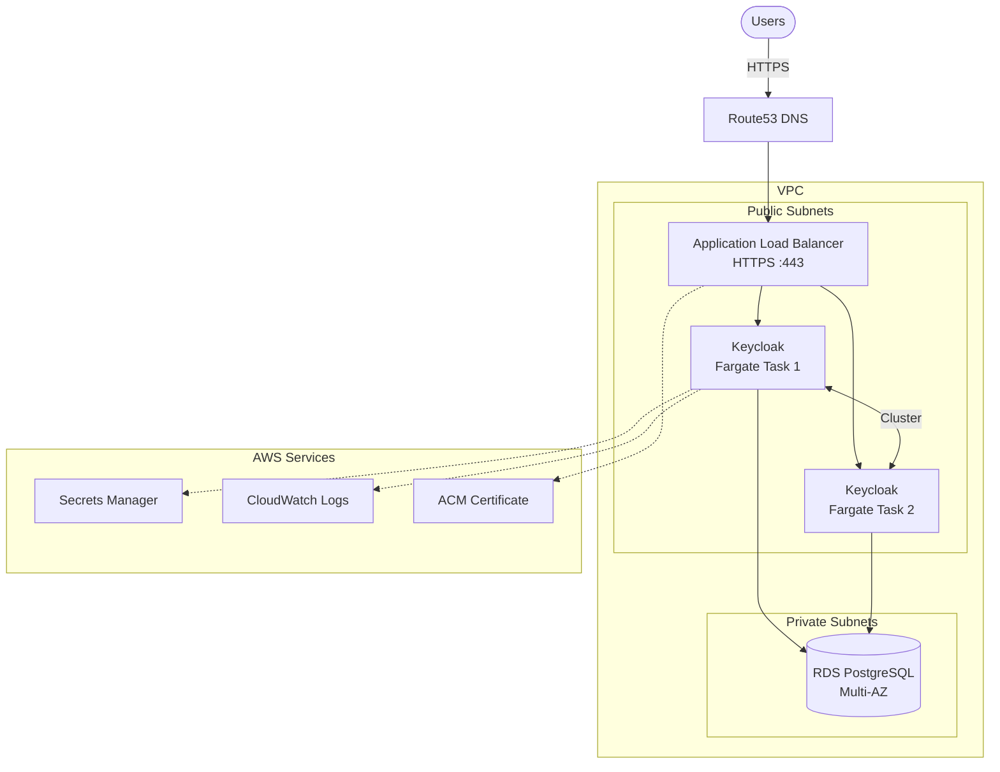

# Terraform AWS Keycloak

This Terraform module deploys a production-ready Keycloak instance on AWS using ECS Fargate with PostgreSQL RDS.

## Features

- **ECS Fargate**: Serverless container orchestration - no EC2 instances to manage
- **High Availability**: Multi-AZ deployment with auto-scaling (2-10 instances by default)
- **Clustering**: Automatic Keycloak cluster formation using JDBC_PING
- **Managed Database**: RDS PostgreSQL with automated backups and optional Multi-AZ
- **HTTPS Only**: ACM certificate with automatic DNS validation and HTTP-to-HTTPS redirect
- **Secrets Management**: AWS Secrets Manager for admin and database credentials
- **Observability**: CloudWatch logs, Container Insights, optional VPC Flow Logs
- **Auto-Scaling**: CPU and memory-based scaling policies
- **Optional Bastion**: SSM-enabled bastion host for database access

## Architecture Overview



## Prerequisites

Before using this module, ensure you have:

1. **Terraform >= 1.9.8** installed
2. **AWS CLI** configured with appropriate credentials
3. **AWS Account** with permissions to create:

- VPC, Subnets, Security Groups
- ECS Cluster, Services, Task Definitions
- RDS PostgreSQL instances
- Application Load Balancer
- ACM Certificates
- Route53 records
- IAM Roles and Policies
- Secrets Manager secrets
- CloudWatch Log Groups

4. **Route53 Hosted Zone** for your domain (for DNS validation and record creation)

## Required Variables

| Variable          | Description                   | Example              |
| ----------------- | ----------------------------- | -------------------- |
| `project_name`    | Name prefix for all resources | `"myapp"`            |
| `domain_name`     | Domain name for Keycloak      | `"auth.example.com"` |
| `route53_zone_id` | Route53 hosted zone ID        | `"Z1234567890ABC"`   |

## Optional Variables

### General Configuration

| Variable | Description                    | Default |
| -------- | ------------------------------ | ------- |
| `tags`   | Tags to apply to all resources | `{}`    |

### VPC Configuration

| Variable                       | Description                                 | Default                            |
| ------------------------------ | ------------------------------------------- | ---------------------------------- |
| `vpc_cidr`                     | CIDR block for the VPC                      | `"10.0.0.0/16"`                    |
| `vpc_public_subnet_cidrs`      | CIDR blocks for public subnets              | `["10.0.1.0/24", "10.0.2.0/24"]`   |
| `vpc_private_subnet_cidrs`     | CIDR blocks for private subnets             | `["10.0.10.0/24", "10.0.11.0/24"]` |
| `vpc_availability_zones`       | Availability zones (auto-detected if empty) | `[]`                               |
| `vpc_enable_flow_logs`         | Enable VPC flow logs                        | `false`                            |
| `vpc_flow_logs_retention_days` | Flow logs retention period                  | `14`                               |

### ALB Configuration

| Variable                  | Description                       | Default                                 |
| ------------------------- | --------------------------------- | --------------------------------------- |
| `alb_internal`            | Whether ALB is internal           | `false`                                 |
| `alb_idle_timeout`        | Connection idle timeout (seconds) | `60`                                    |
| `alb_access_logs_enabled` | Enable ALB access logs            | `false`                                 |
| `alb_ssl_policy`          | SSL policy for HTTPS listener     | `"ELBSecurityPolicy-TLS13-1-2-2021-06"` |

### Keycloak Task Configuration

| Variable                                    | Description                             | Default                              |
| ------------------------------------------- | --------------------------------------- | ------------------------------------ |
| `keycloak_image`                            | Docker image for Keycloak               | `"quay.io/keycloak/keycloak:26.0.6"` |
| `keycloak_cross_account_ecr_repository_arn` | ECR repository ARN from another account | `""`                                 |
| `keycloak_task_cpu`                         | CPU units (1024 = 1 vCPU)               | `1024`                               |
| `keycloak_task_memory`                      | Memory in MB                            | `2048`                               |
| `keycloak_desired_count`                    | Desired number of tasks                 | `2`                                  |
| `keycloak_min_capacity`                     | Minimum tasks for auto-scaling          | `2`                                  |
| `keycloak_max_capacity`                     | Maximum tasks for auto-scaling          | `10`                                 |
| `keycloak_autoscaling_cpu_target`           | CPU target for auto-scaling (%)         | `70`                                 |
| `keycloak_autoscaling_memory_target`        | Memory target for auto-scaling (%)      | `80`                                 |

### Keycloak Application Configuration

| Variable                       | Description                              | Default   |
| ------------------------------ | ---------------------------------------- | --------- |
| `keycloak_admin_username`      | Admin username                           | `"admin"` |
| `keycloak_admin_password`      | Admin password (auto-generated if empty) | `""`      |
| `keycloak_hostname_strict`     | Enable strict hostname checking          | `true`    |
| `keycloak_log_level`           | Log level                                | `"INFO"`  |
| `keycloak_additional_env_vars` | Additional environment variables         | `[]`      |
| `keycloak_additional_secrets`  | Additional secrets from Secrets Manager  | `[]`      |

> **Note**: Build-time settings like `KC_DB`, `KC_CACHE`, `KC_HEALTH_ENABLED`, `KC_METRICS_ENABLED`, and `KC_FEATURES` should be configured in your Dockerfile, not as runtime variables. See the [Keycloak Image](#keycloak-image) section.

### RDS Configuration

| Variable                           | Description                                | Default         |
| ---------------------------------- | ------------------------------------------ | --------------- |
| `rds_engine_version`               | PostgreSQL engine version                  | `"16.4"`        |
| `rds_instance_class`               | RDS instance class                         | `"db.t3.micro"` |
| `rds_allocated_storage`            | Allocated storage in GB                    | `20`            |
| `rds_max_allocated_storage`        | Max storage for autoscaling (0 to disable) | `100`           |
| `rds_database_name`                | Database name                              | `"keycloak"`    |
| `rds_username`                     | Master username                            | `"keycloak"`    |
| `rds_multi_az`                     | Enable Multi-AZ deployment                 | `false`         |
| `rds_backup_retention_period`      | Backup retention in days                   | `7`             |
| `rds_deletion_protection`          | Enable deletion protection                 | `false`         |
| `rds_storage_encrypted`            | Enable storage encryption                  | `true`          |
| `rds_performance_insights_enabled` | Enable Performance Insights                | `false`         |

### Bastion Host Configuration

| Variable                      | Description              | Default      |
| ----------------------------- | ------------------------ | ------------ |
| `bastion_enabled`             | Enable bastion host      | `false`      |
| `bastion_instance_type`       | EC2 instance type        | `"t3.micro"` |
| `bastion_allowed_cidr_blocks` | CIDRs allowed to connect | `[]`         |

## Outputs

| Output                       | Description                              |
| ---------------------------- | ---------------------------------------- |
| `keycloak_url`               | URL for Keycloak                         |
| `ecs_cluster_name`           | Name of the ECS cluster                  |
| `ecs_service_name`           | Name of the ECS service                  |
| `keycloak_admin_secret_arn`  | ARN of Keycloak admin credentials secret |
| `rds_master_user_secret_arn` | ARN of RDS master credentials secret     |
| `rds_endpoint`               | RDS instance endpoint                    |
| `cloudwatch_log_group_name`  | CloudWatch log group name                |
| `bastion_instance_id`        | Bastion instance ID (if enabled)         |

## Usage

This module requires two AWS providers:

- `aws` - Primary provider for infrastructure (ECS, RDS, ALB, etc.)
- `aws.dns` - Provider for Route53 DNS records (can be same or different account)

### Basic Example (Same Account DNS)

```hcl
# Configure providers
provider "aws" {
  region = "us-east-1"
}

provider "aws" {
  alias  = "dns"
  region = "us-east-1"
}

# Deploy Keycloak
module "keycloak" {
  source = "path/to/terraform-aws-keycloak"

  providers = {
    aws     = aws
    aws.dns = aws.dns
  }

  project_name    = "myapp"
  domain_name     = "auth.example.com"
  route53_zone_id = "Z1234567890ABC"

  keycloak_image = "your-account.dkr.ecr.us-east-1.amazonaws.com/keycloak:26.0.6"

  tags = {
    Environment = "production"
    Team        = "platform"
  }
}

output "keycloak_url" {
  value = module.keycloak.keycloak_url
}
```

### Cross-Account DNS Example

When your Route53 hosted zone is in a different AWS account (common in enterprise setups):

```hcl
# Primary provider - where infrastructure will be deployed
provider "aws" {
  region = "us-east-1"
}

# DNS provider - assumes role in the DNS/shared-services account
provider "aws" {
  alias  = "dns"
  region = "us-east-1"

  assume_role {
    role_arn     = "arn:aws:iam::111111111111:role/Route53AccessRole"
    session_name = "keycloak-terraform"
  }
}

module "keycloak" {
  source = "path/to/terraform-aws-keycloak"

  providers = {
    aws     = aws
    aws.dns = aws.dns
  }

  project_name    = "myapp"
  domain_name     = "auth.example.com"
  route53_zone_id = "Z1234567890ABC"  # Zone ID in the DNS account

  keycloak_image = "your-account.dkr.ecr.us-east-1.amazonaws.com/keycloak:26.0.6"

  tags = {
    Environment = "production"
  }
}
```

**Required IAM Role in DNS Account:**

The role in the DNS account needs permissions to manage Route53 records:

```json
{
  "Version": "2012-10-17",
  "Statement": [
    {
      "Effect": "Allow",
      "Action": [
        "route53:GetHostedZone",
        "route53:ChangeResourceRecordSets",
        "route53:ListResourceRecordSets"
      ],
      "Resource": "arn:aws:route53:::hostedzone/Z1234567890ABC"
    },
    {
      "Effect": "Allow",
      "Action": "route53:ListHostedZones",
      "Resource": "*"
    }
  ]
}
```

And a trust policy allowing the workload account to assume it:

```json
{
  "Version": "2012-10-17",
  "Statement": [
    {
      "Effect": "Allow",
      "Principal": {
        "AWS": "arn:aws:iam::222222222222:root"
      },
      "Action": "sts:AssumeRole"
    }
  ]
}
```

### Production Example

```hcl
module "keycloak" {
  source = "path/to/terraform-aws-keycloak"

  providers = {
    aws     = aws
    aws.dns = aws.dns
  }

  project_name    = "myapp"
  domain_name     = "auth.example.com"
  route53_zone_id = "Z1234567890ABC"

  # VPC Configuration
  vpc_cidr                 = "10.100.0.0/16"
  vpc_public_subnet_cidrs  = ["10.100.1.0/24", "10.100.2.0/24", "10.100.3.0/24"]
  vpc_private_subnet_cidrs = ["10.100.10.0/24", "10.100.11.0/24", "10.100.12.0/24"]
  vpc_enable_flow_logs     = true

  # ALB Configuration
  alb_access_logs_enabled = true

  # Keycloak Configuration
  keycloak_image         = "quay.io/keycloak/keycloak:26.0.6"
  keycloak_task_cpu      = 2048
  keycloak_task_memory   = 4096
  keycloak_desired_count = 3
  keycloak_min_capacity  = 2
  keycloak_max_capacity  = 10
  keycloak_log_level     = "INFO"

  # RDS Configuration (Production)
  rds_instance_class               = "db.r6g.large"
  rds_allocated_storage            = 100
  rds_multi_az                     = true
  rds_backup_retention_period      = 14
  rds_deletion_protection          = true
  rds_skip_final_snapshot          = false
  rds_performance_insights_enabled = true

  # Logging
  log_retention_days = 90

  # Enable bastion for database access
  bastion_enabled = true

  tags = {
    Environment = "production"
    Team        = "platform"
    CostCenter  = "infrastructure"
  }
}
```

## Keycloak Docker Image

This module requires a custom-built Keycloak Docker image optimized for production. **Do not use the default Keycloak image directly** - it runs in development mode and performs optimization at startup, resulting in slow container starts.

### Why Build a Custom Image?

Keycloak is built on [Quarkus](https://quarkus.io/), a framework that performs ahead-of-time compilation. When you run `kc.sh build`, Keycloak:

1. **Compiles in only what you need** - If you specify `KC_DB=postgres`, only the PostgreSQL driver is included (not MySQL, Oracle, etc.)
2. **Pre-configures the application** - Framework initialization happens at build time, not startup
3. **Reduces startup time** - From 30-60 seconds down to 3-5 seconds
4. **Reduces memory usage** - Unused code paths are eliminated

### Production Dockerfile

Create this Dockerfile in your Keycloak image repository:

```dockerfile
# =============================================================================
# KEYCLOAK PRODUCTION IMAGE
# =============================================================================
# This Dockerfile creates an optimized Keycloak image for production use.
# Build-time configuration is baked in; runtime config is passed via env vars.
# =============================================================================

ARG KEYCLOAK_VERSION=26.0.6
FROM quay.io/keycloak/keycloak:${KEYCLOAK_VERSION} AS builder

# =============================================================================
# BUILD-TIME CONFIGURATION
# These settings are compiled into the application and CANNOT be changed at
# runtime. Changing these requires rebuilding the Docker image.
# =============================================================================

# Database: Only PostgreSQL driver will be included
ENV KC_DB=postgres

# Health & Metrics: Compile health check and metrics endpoints
ENV KC_HEALTH_ENABLED=true
ENV KC_METRICS_ENABLED=true

# Clustering: Use Infinispan cache with TCP transport for JDBC_PING discovery
ENV KC_CACHE=ispn
ENV KC_CACHE_STACK=tcp

# Optional: Enable specific features (uncomment as needed)
# ENV KC_FEATURES=token-exchange,admin-fine-grained-authz

# Optional: Disable specific features (uncomment as needed)
# ENV KC_FEATURES_DISABLED=impersonation

WORKDIR /opt/keycloak

# Build the optimized Keycloak distribution
RUN /opt/keycloak/bin/kc.sh build

# =============================================================================
# PRODUCTION IMAGE
# =============================================================================
FROM quay.io/keycloak/keycloak:${KEYCLOAK_VERSION}

# Copy the optimized build from the builder stage
COPY --from=builder /opt/keycloak/ /opt/keycloak/

ENTRYPOINT ["/opt/keycloak/bin/kc.sh"]

# Start in optimized mode (skips build-time work)
CMD ["start", "--optimized"]
```

### Building and Pushing the Image

```bash
# Build the image
docker build \
  --build-arg KEYCLOAK_VERSION=26.0.6 \
  -t your-account.dkr.ecr.us-east-1.amazonaws.com/keycloak:26.0.6 \
  .

# Push to ECR
aws ecr get-login-password --region us-east-1 | \
  docker login --username AWS --password-stdin your-account.dkr.ecr.us-east-1.amazonaws.com

docker push your-account.dkr.ecr.us-east-1.amazonaws.com/keycloak:26.0.6
```

### Adding Custom Themes or Providers

If you have custom themes or SPI providers, add them to the builder stage:

```dockerfile
FROM quay.io/keycloak/keycloak:${KEYCLOAK_VERSION} AS builder

# ... build-time ENV vars ...

# Add custom theme
COPY --chown=keycloak:keycloak my-theme /opt/keycloak/themes/my-theme

# Add custom SPI provider
COPY --chown=keycloak:keycloak my-provider.jar /opt/keycloak/providers/

WORKDIR /opt/keycloak
RUN /opt/keycloak/bin/kc.sh build

# ... rest of Dockerfile ...
```

### Build-Time vs Runtime Configuration

Understanding when configuration is applied is critical for Keycloak:

#### Build-Time Configuration (Dockerfile)

These settings are **compiled into the image** during `kc.sh build`. Changing them requires rebuilding the Docker image.

| Variable                  | Purpose              | Why Build-Time?                                                                      |
| ------------------------- | -------------------- | ------------------------------------------------------------------------------------ |
| `KC_DB=postgres`          | Database type        | Only includes PostgreSQL JDBC driver, excludes MySQL/Oracle/etc. Reduces image size. |
| `KC_HEALTH_ENABLED=true`  | Health endpoints     | Compiles `/health/`\* endpoints into the application                                 |
| `KC_METRICS_ENABLED=true` | Metrics endpoints    | Compiles `/metrics` endpoint into the application                                    |
| `KC_CACHE=ispn`           | Cache provider       | Includes Infinispan distributed cache libraries                                      |
| `KC_CACHE_STACK=tcp`      | Clustering transport | Includes TCP-based JGroups stack for JDBC_PING                                       |
| `KC_FEATURES=...`         | Feature flags        | Compiles optional features into the application                                      |

#### Runtime Configuration (ECS Task Definition)

These settings are **read at container startup** and can differ per environment. This module configures these automatically.

| Variable                  | Purpose                    | Why Runtime?                                 |
| ------------------------- | -------------------------- | -------------------------------------------- |
| `KC_DB_URL`               | Database connection string | Different per environment (dev/staging/prod) |
| `KC_DB_USERNAME`          | Database username          | Secret, should not be in image               |
| `KC_DB_PASSWORD`          | Database password          | Secret, should not be in image               |
| `KC_HOSTNAME`             | Public hostname            | Different per environment                    |
| `KC_HOSTNAME_STRICT`      | Hostname validation        | May vary by environment                      |
| `KC_PROXY_HEADERS`        | Proxy mode                 | Infrastructure-dependent                     |
| `KC_HTTP_ENABLED`         | Enable HTTP                | Required when TLS terminates at ALB          |
| `KC_LOG_LEVEL`            | Logging verbosity          | May change for debugging without rebuild     |
| `KEYCLOAK_ADMIN`          | Initial admin username     | Secret, only used on first startup           |
| `KEYCLOAK_ADMIN_PASSWORD` | Initial admin password     | Secret, only used on first startup           |
| `JAVA_OPTS_APPEND`        | JVM options                | Clustering DNS config, memory tuning         |

#### What This Module Handles Automatically

The ECS task definition in this module automatically configures:

```
KC_DB_URL          → jdbc:postgresql://<rds-endpoint>/<database>
KC_HOSTNAME        → <your-domain-name>
KC_HOSTNAME_STRICT → true
KC_PROXY_HEADERS   → xforwarded (for ALB)
KC_HTTP_ENABLED    → true (ALB terminates TLS)
KC_LOG_LEVEL       → INFO (configurable via variable)
JAVA_OPTS_APPEND   → JGroups DNS query for clustering

Secrets (from AWS Secrets Manager):
KC_DB_USERNAME     → RDS master username
KC_DB_PASSWORD     → RDS master password
KEYCLOAK_ADMIN     → Admin username
KEYCLOAK_ADMIN_PASSWORD → Admin password
```

### One Image, Multiple Environments

The goal is **build once, deploy everywhere**:

```
┌──────────────────────────────────────────────────────────────────────┐
│                           Docker Build                                │
│                                                                       │
│  Dockerfile + kc.sh build  ──►  keycloak:26.0.6                      │
│                                       │                               │
│  Baked in:                            │                               │
│  - PostgreSQL driver                  │                               │
│  - Health/metrics endpoints           │                               │
│  - Infinispan clustering              │                               │
└───────────────────────────────────────┼───────────────────────────────┘
                                        │
            ┌───────────────────────────┼───────────────────────────┐
            │                           │                           │
            ▼                           ▼                           ▼
┌───────────────────────┐  ┌───────────────────────┐  ┌───────────────────────┐
│     Development       │  │       Staging         │  │      Production       │
│                       │  │                       │  │                       │
│ KC_HOSTNAME=          │  │ KC_HOSTNAME=          │  │ KC_HOSTNAME=          │
│   auth-dev.example.com│  │   auth-stg.example.com│  │   auth.example.com    │
│                       │  │                       │  │                       │
│ KC_DB_URL=            │  │ KC_DB_URL=            │  │ KC_DB_URL=            │
│   jdbc:postgresql://  │  │   jdbc:postgresql://  │  │   jdbc:postgresql://  │
│   dev-db/keycloak     │  │   stg-db/keycloak     │  │   prod-db/keycloak    │
│                       │  │                       │  │                       │
│ KC_LOG_LEVEL=DEBUG    │  │ KC_LOG_LEVEL=INFO     │  │ KC_LOG_LEVEL=WARN     │
└───────────────────────┘  └───────────────────────┘  └───────────────────────┘
```

## Updating Keycloak

This module uses Terraform-managed rolling updates. To update Keycloak:

### 1. Update the Image Variable

```hcl
keycloak_image = "quay.io/keycloak/keycloak:26.1.0"
```

### 2. Apply the Change

```bash
terraform plan   # Review the changes
terraform apply  # Apply the update
```

### 3. Monitor the Deployment

ECS performs a rolling update:

1. New tasks are launched with the new image
2. ALB health checks verify new tasks are healthy
3. Traffic shifts to new tasks
4. Old tasks are drained and stopped

```bash
# Watch the deployment
aws ecs describe-services \
  --cluster $(terraform output -raw ecs_cluster_name) \
  --services $(terraform output -raw ecs_service_name) \
  --query 'services[0].deployments'
```

### Automatic Rollback

The module configures deployment circuit breaker with automatic rollback. If new tasks fail health checks, ECS automatically rolls back to the previous version.

## Post-Deployment Steps

### 1. Verify ECS Service Health

```bash
aws ecs describe-services \
  --cluster $(terraform output -raw ecs_cluster_name) \
  --services $(terraform output -raw ecs_service_name) \
  --query 'services[0].{status:status,runningCount:runningCount,desiredCount:desiredCount}'
```

### 2. Access Keycloak Admin Console

```bash
# Get the admin credentials
aws secretsmanager get-secret-value \
  --secret-id $(terraform output -raw keycloak_admin_secret_arn) \
  --query 'SecretString' \
  --output text | jq .
```

Then navigate to `https://auth.example.com/admin` and log in with the credentials.

### 3. Verify Cluster Formation

Check the Keycloak logs to verify that instances have formed a cluster:

```bash
# View recent logs
aws logs tail $(terraform output -raw cloudwatch_log_group_name) --since 5m --follow
```

Look for messages like:

```
INFO [org.infinispan.CLUSTER] ISPN000094: Received new cluster view: [node1|1] (2) [node1, node2]
```

## Database Access

### Using Session Manager (Recommended)

If you enabled the bastion host, you can use AWS Session Manager to access the database:

```bash
# Start a session
aws ssm start-session \
  --target $(terraform output -raw bastion_instance_id)

# Once connected, use psql
psql -h <rds-endpoint> -U keycloak -d keycloak
```

### Using Session Manager Port Forwarding

```bash
# Start port forwarding
aws ssm start-session \
  --target $(terraform output -raw bastion_instance_id) \
  --document-name AWS-StartPortForwardingSessionToRemoteHost \
  --parameters '{
    "host":["your-rds-endpoint.rds.amazonaws.com"],
    "portNumber":["5432"],
    "localPortNumber":["5432"]
  }'

# In another terminal, connect locally
psql -h localhost -U keycloak -d keycloak
```

## Keycloak Clustering

This module configures Keycloak clustering using JDBC_PING:

1. **JDBC_PING**: Keycloak nodes discover each other via the PostgreSQL database
2. **Infinispan**: Distributed cache replicates sessions across all nodes
3. **Service Discovery**: AWS Cloud Map provides DNS-based discovery as a fallback

## Cost Estimate

Approximate monthly costs (us-east-1, as of 2024):

| Component      | Configuration             | Estimated Cost  |
| -------------- | ------------------------- | --------------- |
| ECS Fargate    | 2 tasks × 1 vCPU × 2GB    | ~$60            |
| RDS PostgreSQL | db.t3.micro, 20GB         | ~$15            |
| ALB            | 1 ALB + LCU charges       | ~$20            |
| Route53        | Hosted zone + queries     | ~$1             |
| CloudWatch     | Logs + Container Insights | ~$10            |
| **Total**      |                           | **~$105/month** |

For production with Multi-AZ RDS and larger instances, expect $250-400/month.

## Security Considerations

### Implemented Security Features

- **Security Groups**: Strict ingress rules (ALB → ECS → RDS)
- **Encryption**: RDS storage encryption, HTTPS only
- **Secrets Management**: Credentials stored in AWS Secrets Manager (password changes ignored after initial setup)
- **IMDSv2**: Bastion host requires IMDSv2
- **Private Database**: RDS runs in private subnets with no internet access

### Recommendations

1. **Enable VPC Flow Logs** for network monitoring
2. **Enable RDS deletion protection** for production
3. **Use Multi-AZ RDS** for production high availability
4. **Change admin password** after initial deployment
5. **Enable RDS Performance Insights** for production monitoring
6. **Consider AWS WAF** for additional protection

## Troubleshooting

### ECS Tasks Not Starting

1. Check CloudWatch logs:

```bash
 aws logs tail $(terraform output -raw cloudwatch_log_group_name) --since 30m
```

2. Check task stopped reason:

```bash
 aws ecs describe-tasks \
   --cluster $(terraform output -raw ecs_cluster_name) \
   --tasks $(aws ecs list-tasks --cluster $(terraform output -raw ecs_cluster_name) --query 'taskArns[0]' --output text)
```

### Database Connection Issues

1. Verify security groups allow traffic
2. Check RDS endpoint is correct in task definition
3. Verify Secrets Manager permissions

### Cluster Not Forming

1. Verify service discovery is working
2. Check JGroups port (7800) is open between tasks
3. Verify DNS resolution from within tasks

## Maintenance

### Updating Keycloak Version

1. Update the `keycloak_image` variable
2. Run `terraform apply`
3. ECS will perform a rolling update

### Scaling

Adjust `keycloak_min_capacity` and `keycloak_max_capacity` for manual scaling bounds, or let auto-scaling handle it based on CPU/memory utilization.

### Database Maintenance

RDS maintenance windows are configurable via `rds_maintenance_window`. During maintenance, there may be brief interruptions for single-AZ deployments.

## License

MIT License - see LICENSE file for details.
